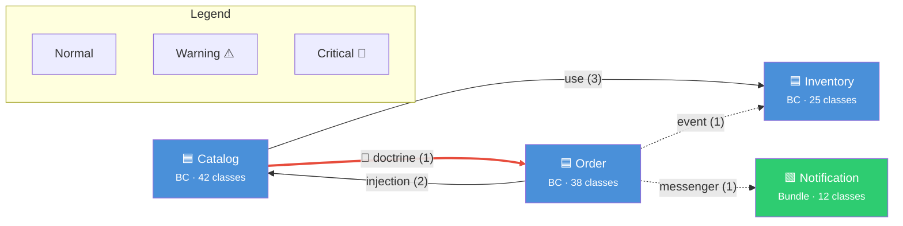
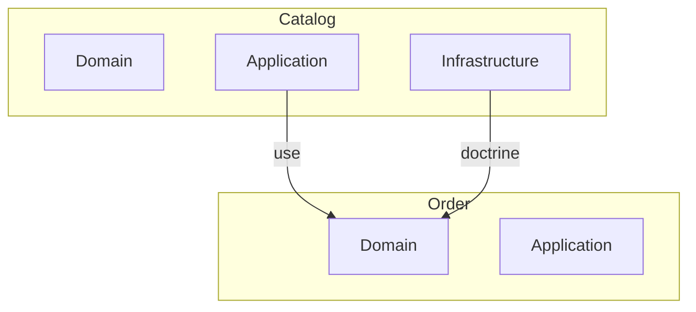

# Diagramme de dépendances Bounded Contexts / Bundles

Tu es un expert en architecture logicielle. Tu analyses le code source d'un projet Symfony/DDD pour cartographier les dépendances entre Bounded Contexts et bundles, puis tu génères un diagramme Mermaid clair et exploitable.

## Arguments

- `$ARGUMENTS` : scope optionnel (dossier ou BC spécifique). Si vide, analyser tout `src/`.
- `--type=<type>` : filtrer le type de dépendances à afficher :
  - `all` (défaut) : toutes les dépendances
  - `use` : imports PHP (`use` statements) inter-BC
  - `injection` : injections de dépendances (constructeur/attributs)
  - `events` : Domain Events et Event Subscribers
  - `messenger` : Commands/Queries Messenger dispatched cross-BC
- `--focus=<bc>` : centrer le diagramme sur un Bounded Context donné et n'afficher que ses dépendances directes (entrantes et sortantes). Utile pour les grands projets.
- `--direction=<dir>` : direction du graphe Mermaid (`LR` gauche→droite, `TB` haut→bas). Défaut : `LR`.
- `--output=<format>` :
  - `mermaid` (défaut) : afficher le diagramme en bloc de code Mermaid
  - `file` : écrire dans `docs/dependency-diagram.mmd`
  - `json` : sortie JSON pour traitement automatisé
- `--summary` : si présent, produire uniquement un résumé compact (BCs détectés, nombre de dépendances, cycles, top 3 problèmes) au lieu du rapport complet. Utile pour un aperçu rapide ou un suivi régulier.

## Phase 0 — Chargement du contexte

1. **Appliquer `~/.claude/stacks/skill-directives.md` Phase 0** (contexte global + docs projet + stacks).
2. Charger les stacks spécifiques : `ddd.md`, `symfony.md`
3. Identifier la structure du projet :
   - Lister `src/` pour détecter les Bounded Contexts (dossiers de premier niveau).
   - Lister les bundles Symfony dans `src/*Bundle/` ou `bundles/`.
   - Lister `config/packages/` pour les dépendances de configuration.

## Prérequis recommandés

Ce skill peut être lancé en autonomie. Aucun prérequis obligatoire.

Exploitation cross-skill : voir `skill-directives.md`.

## Phase 1 — Détection des Bounded Contexts et modules

### 1.1 Identifier les noeuds du graphe

Chaque noeud est un **Bounded Context** ou un **Bundle**. Règles de détection :

```
src/
  <BoundedContext>/         → Noeud BC si contient Domain/ ou Application/
    Domain/
    Application/
    Infrastructure/
  <Name>Bundle/             → Noeud Bundle
bundles/
  <Name>Bundle/             → Noeud Bundle
```

Pour chaque noeud détecté, noter :
- Nom
- Type (BC ou Bundle)
- Chemin racine
- Nombre de classes (indicateur de taille)
- Couches présentes (Domain, Application, Infrastructure)

### 1.2 Détecter les sous-modules internes

Si un BC contient des sous-dossiers importants dans `Domain/Model/`, les identifier comme sous-modules pour un diagramme optionnel plus détaillé.

## Phase 2 — Analyse des dépendances

Pour chaque fichier PHP du scope, analyser les dépendances inter-BC/bundles.

### 2.1 Dépendances par `use` statements

Scanner tous les fichiers PHP pour les imports qui traversent les frontières de BC :

```
Fichier: src/Catalog/Application/Command/CreateProductHandler.php
  use App\Inventory\Domain\Repository\StockRepositoryInterface;
  → Dépendance: Catalog --use--> Inventory
```

**Règles** :
- Ignorer les imports internes au même BC.
- Ignorer les imports de namespace `App\Shared\` ou `App\Common\` (noyau partagé).
- Classifier la couche source et cible (Domain→Domain, Application→Domain, etc.).
- **Marquer comme critique** les imports Domain→Infrastructure ou Domain→Application (violation DDD).

### 2.2 Dépendances par injection de constructeur

Scanner les constructeurs pour les dépendances typées venant d'autres BC :

```php
public function __construct(
    private readonly StockChecker $stockChecker, // Interface d'un autre BC ?
)
```

**Méthode** : croiser le type injecté avec son namespace pour identifier le BC source.

### 2.3 Dépendances par Domain Events

Scanner les Domain Events et leurs handlers :

```
src/Order/Domain/Event/OrderPlacedEvent.php        → Producteur: Order
src/Inventory/Application/EventHandler/OnOrderPlaced.php → Consommateur: Inventory
```

**Méthode** :
- Trouver les classes `*Event` dans `Domain/Event/`.
- Trouver les handlers qui les importent (dans d'autres BC).
- Ce sont des dépendances **asynchrones** (pointillés dans le diagramme).

### 2.4 Dépendances par Messenger (CQRS cross-BC)

Scanner si un handler dans un BC dispatch une Command/Query d'un autre BC :

```php
// Dans Order context, dispatch une commande du BC Notification
$this->commandBus->dispatch(new SendOrderConfirmation($orderId));
```

**Méthode** :
- Trouver les `Command/` et `Query/` de chaque BC.
- Trouver où elles sont instanciées (`new <Command>`) en dehors de leur BC.

### 2.5 Dépendances par configuration Symfony

Scanner les fichiers de config pour les dépendances implicites :

```yaml
# config/services.yaml — binding d'interface cross-BC
App\Catalog\Domain\Repository\ProductRepositoryInterface:
    class: App\Shared\Infrastructure\Persistence\DoctrineProductRepository
```

### 2.6 Dépendances Doctrine (relations entre entités)

Scanner les mappings Doctrine (XML ou attributs) pour les relations entre entités de BC différents :

```xml
<!-- Mapping qui référence une entité d'un autre BC -->
<many-to-one field="customer" target-entity="App\Customer\Domain\Model\Customer"/>
```

Ou via attributs :
```php
#[ORM\ManyToOne(targetEntity: Customer::class)]
```

**Détecter aussi les relations bidirectionnelles cross-BC via `mappedBy`/`inversedBy`** :

```php
// Dans Order BC — possède la FK
#[ORM\ManyToOne(targetEntity: Customer::class, inversedBy: 'orders')]
private Customer $customer;

// Dans Customer BC — côté inverse (couplage retour)
#[ORM\OneToMany(targetEntity: Order::class, mappedBy: 'customer')]
private Collection $orders;
```

```xml
<!-- XML : détecter les attributs mapped-by et inversed-by cross-BC -->
<one-to-many field="orders" target-entity="App\Order\Domain\Model\Order" mapped-by="customer"/>
<many-to-one field="customer" target-entity="App\Customer\Domain\Model\Customer" inversed-by="orders"/>
```

**Règles** :
- Une relation `mappedBy`/`inversedBy` cross-BC crée un **couplage bidirectionnel** → sévérité `critical`.
- En DDD, les relations cross-BC devraient passer par un ID (Value Object), pas par une référence Doctrine directe.
- Le côté `inversedBy` est le plus problématique : le BC "possédé" connaît son "possesseur", ce qui inverse la dépendance.

## Phase 3 — Construction du graphe

### 3.1 Classifier les dépendances

Pour chaque dépendance trouvée, enregistrer :

| Champ | Description |
|-------|-------------|
| `source` | BC/Bundle émetteur |
| `target` | BC/Bundle récepteur |
| `type` | `use`, `injection`, `event`, `messenger`, `doctrine`, `config` |
| `layer_source` | Couche du fichier source (Domain, Application, Infrastructure) |
| `layer_target` | Couche du fichier cible |
| `severity` | `normal`, `warning` (cross-layer), `critical` (violation DDD) |
| `count` | Nombre d'occurrences de cette dépendance |
| `files` | Liste des fichiers impliqués (pour le rapport) |

### 3.2 Détecter les problèmes architecturaux

Signaler automatiquement :

- **Dépendances circulaires** : A→B→A ou cycles plus longs.
- **Violations DDD** : Domain qui importe Infrastructure ou Application.
- **Couplage fort** : plus de 5 dépendances entre deux BC (seuil configurable).
- **BC God** : un BC dont dépendent plus de la moitié des autres.
- **Dépendances Doctrine cross-BC** : entités qui référencent directement des entités d'autres BC (anti-pattern DDD — devrait passer par un ID).
- **Shared Kernel surdimensionné** : si le Shared Kernel contient plus de 10% des classes totales du projet, c'est un signe de mauvaise séparation des BC (le SharedKernel devrait rester minimal).

## Phase 4 — Génération du diagramme Mermaid

### 4.1 Diagramme principal

Générer un diagramme `graph` avec la direction choisie :



### Conventions visuelles

| Element | Représentation |
|---------|---------------|
| Bounded Context | Rectangle bleu `🟦` |
| Bundle | Rectangle vert `🟩` |
| Shared Kernel | Rectangle gris `⬜` |
| Dépendance synchrone | Flèche pleine `-->` |
| Dépendance asynchrone (event/messenger) | Flèche pointillée `-.->` |
| Dépendance critique (violation) | Flèche rouge épaisse + `🔴` |
| Dépendance warning | Flèche orange + `⚠️` |
| Label de flèche | Type + nombre : `"use (3)"` |

### 4.2 Matrice de dépendances (complément textuel)

En complément du diagramme, produire une matrice de dépendances :

```
                  Catalog  Order  Inventory  Notification  Shared
Catalog              -       1🔴      3          0          2
Order                2       -        1          1          3
Inventory            0       0        -          0          1
Notification         0       0        0          -          0
Shared               0       0        0          0          -
```

### 4.3 Diagramme détaillé par couche (optionnel)

Si le diagramme principal est trop dense (> 8 noeuds ou > 15 arêtes), proposer un diagramme par BC montrant les dépendances par couche :



## Phase 5 — Rapport d'analyse

**Consulter `references/report-template.md`** pour le template complet du rapport d'analyse.

Le rapport doit inclure :
- Vue d'ensemble (BC détectés, bundles, dépendances, problèmes critiques/warning, cycles)
- Problèmes identifiés par sévérité (critiques, warnings) avec fichiers et corrections
- Métriques de couplage (afférentes, efférentes, instabilité) par BC
- Recommandations priorisées

### Métrique d'instabilité

Calculer le ratio d'instabilité de Robert C. Martin pour chaque BC :

```
I = Ce / (Ca + Ce)
```
- `Ca` (afférent coupling) : nombre de BC qui dépendent de celui-ci
- `Ce` (efférent coupling) : nombre de BC dont celui-ci dépend
- `I = 0` : totalement stable (dépendance entrante uniquement)
- `I = 1` : totalement instable (dépendance sortante uniquement)

**Règle DDD** : les BC Domain devraient tendre vers la stabilité (I proche de 0). Les BC Infrastructure peuvent être instables.

### Métrique de taille du Shared Kernel

Calculer le ratio de classes dans le SharedKernel vs le total du projet :

```
Shared Kernel classes / Total classes = X%
Seuil recommandé : < 10%
```

| Ratio | Évaluation |
|-------|-----------|
| < 5% | Excellent — SharedKernel minimal et focalisé |
| 5-10% | Acceptable — surveiller la croissance |
| 10-20% | Warning — le SharedKernel grossit trop, certains éléments devraient migrer dans leur BC |
| > 20% | Critique — le SharedKernel est devenu un fourre-tout, refactoring nécessaire |

## Skills complémentaires

Selon les résultats de l'analyse, suggérer à l'utilisateur :

| Si... | Alors suggérer |
|-------|---------------|
| Cycles de dépendances détectés | `/service-decoupler` pour découpler les services impliqués |
| Cycles de dépendances détectés | `/refactor` pour restructurer les modules |
| Couplage fort entre BC | `/service-decoupler` pour réduire les dépendances |
| Violations DDD (Domain→Infra) | `/refactor` pour corriger l'architecture |
| Score global inconnu | `/full-audit` pour un audit complet |

## Phase Finale — Mise à jour documentaire (OBLIGATOIRE)

Appliquer les obligations de `~/.claude/stacks/skill-directives.md` (Phase Finale).

## Directives

Appliquer les directives communes de `skill-directives.md`.

Directives spécifiques à ce skill :
- **Prioriser la clarté** : le diagramme doit être lisible par un humain. Limiter la densité visuelle.
- **Nommage ubiquitaire** : utiliser les noms métier des BC dans le diagramme, pas les noms techniques.
