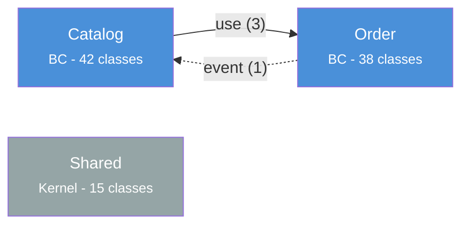

# Template de rapport — Dependency Diagram

## Template rapport complet (--output=mermaid ou --output=file)

### Vue d'ensemble

| Metrique | Valeur |
|----------|--------|
| Bounded Contexts detectes | X |
| Bundles detectes | X |
| Dependances totales | X |
| Dependances critiques | X |
| Dependances warning | X |
| Cycles de dependances | X |
| Taille Shared Kernel | X% (evaluation) |

### Diagramme Mermaid



### Matrice de dependances

```
                  Catalog  Order  Inventory  Notification  Shared
Catalog              -       1        3          0          2
Order                2       -        1          1          3
Inventory            0       0        -          0          1
Notification         0       0        0          -          0
Shared               0       0        0          0          -
```

### Problemes identifies

#### Critiques

| # | Source | Target | Type | Description | Fichiers |
|---|--------|--------|------|-------------|----------|
| 1 | [BC source] | [BC cible] | [doctrine/use/injection] | [Description de la violation] | [liste fichiers] |

#### Warnings

| # | Source | Target | Type | Description | Fichiers |
|---|--------|--------|------|-------------|----------|
| 1 | [BC source] | [BC cible] | [use/injection] | [Description du couplage] | [liste fichiers] |

### Metriques de couplage

| BC | Ca (afferent) | Ce (efferent) | I (instabilite) | Classes | Evaluation |
|----|---------------|---------------|-----------------|---------|-----------|
| Catalog | 2 | 4 | 0.67 | 42 | Instable |
| Order | 3 | 2 | 0.40 | 38 | Equilibre |
| Inventory | 1 | 0 | 0.00 | 25 | Stable |
| Notification | 0 | 2 | 1.00 | 12 | Instable |

### Shared Kernel

| Metrique | Valeur |
|----------|--------|
| Classes dans Shared Kernel | X |
| Classes totales projet | Y |
| Ratio | X/Y = Z% |
| Evaluation | Excellent / Acceptable / Warning / Critique |

Bareme :

| Ratio | Evaluation |
|-------|-----------|
| < 5% | Excellent -- SharedKernel minimal et focalise |
| 5-10% | Acceptable -- surveiller la croissance |
| 10-20% | Warning -- le SharedKernel grossit trop, certains elements devraient migrer dans leur BC |
| > 20% | Critique -- le SharedKernel est devenu un fourre-tout, refactoring necessaire |

### Recommandations

1. **[Priorite haute]** [Description du probleme critique et action corrective]
2. **[Priorite moyenne]** [Description du couplage a reduire et suggestion]
3. **[Priorite basse]** [Amelioration optionnelle]

---

## Template resume (--summary)

```markdown
**Dependency Diagram -- Resume**

| Metrique | Valeur |
|----------|--------|
| BCs | X |
| Dependances | X |
| Cycles | X |
| Shared Kernel | X% |

**Top 3 problemes :**
1. [Source -> Cible] : [description courte]
2. [Source -> Cible] : [description courte]
3. [Source -> Cible] : [description courte]
```

---

## Template JSON (--output=json)

```json
{
  "skill": "dependency-diagram",
  "date": "YYYY-MM-DD",
  "scope": "src/",
  "nodes": [
    {
      "name": "Catalog",
      "type": "bc",
      "classes": 42,
      "layers": ["Domain", "Application", "Infrastructure"]
    },
    {
      "name": "Order",
      "type": "bc",
      "classes": 38,
      "layers": ["Domain", "Application", "Infrastructure"]
    },
    {
      "name": "Shared",
      "type": "shared_kernel",
      "classes": 15,
      "layers": ["Domain"]
    }
  ],
  "edges": [
    {
      "source": "Catalog",
      "target": "Order",
      "type": "use",
      "severity": "normal",
      "count": 3,
      "files": [
        "src/Catalog/Application/Command/CreateProductHandler.php"
      ]
    },
    {
      "source": "Order",
      "target": "Catalog",
      "type": "event",
      "severity": "normal",
      "count": 1,
      "files": [
        "src/Order/Infrastructure/EventHandler/OnCatalogUpdated.php"
      ]
    }
  ],
  "cycles": [],
  "metrics": {
    "shared_kernel_ratio": 0.08,
    "instability": {
      "Catalog": 0.67,
      "Order": 0.40,
      "Inventory": 0.00,
      "Notification": 1.00
    }
  },
  "problems": {
    "critical": [],
    "warning": []
  }
}
```

---

## Template matrice de dependances (complement textuel)

La matrice est toujours generee en complement du diagramme Mermaid. Chaque cellule indique le nombre de dependances de la ligne (source) vers la colonne (cible). Les dependances critiques sont marquees d'un indicateur.

```
                  Catalog  Order  Inventory  Notification  Shared
Catalog              -       1!       3          0          2
Order                2       -        1          1          3
Inventory            0       0        -          0          1
Notification         0       0        0          -          0
Shared               0       0        0          0          -

Legende : ! = contient au moins une dependance critique
```
