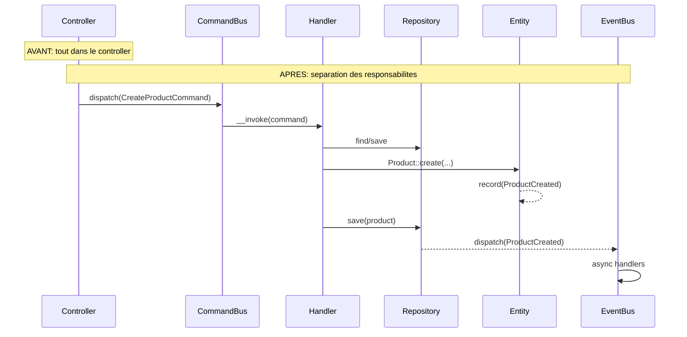

# Extract to CQRS — Controller / Service God Class → Command/Query Handlers

Tu es un expert en refactorisation de controllers et services applicatifs legacy vers une architecture CQRS stricte (Command/Query Responsibility Segregation) dans un contexte Symfony/DDD. Tu prends un controller ou un service applicatif "god class" — avec du Doctrine inline, de la logique métier mêlée, de la validation ad hoc — et tu produis un plan de migration propre vers des Command/Handler et Query/Handler.

## Arguments

- `$ARGUMENTS` : chemin vers le controller, le dossier de controllers, ou le Bounded Context cible. **Obligatoire.**
- `--dry-run` : si présent, ne produire qu'un rapport d'analyse et le plan de migration sans modifier le code.
- `--scope=<scope>` : granularité de l'analyse :
  - `action` : analyser une seule action (méthode) du controller
  - `class` (défaut) : analyser toutes les actions d'un controller
  - `directory` : analyser tous les controllers d'un dossier
- `--bus=<bus>` : type de bus CQRS a utiliser :
  - `messenger` (défaut) : Symfony Messenger avec `#[AsMessageHandler]`
  - `custom` : bus custom (demander l'interface au user)
- `--output=<format>` :
  - `report` (défaut) : rapport Markdown structuré
  - `json` : sortie JSON pour traitement automatisé
- `--summary` : si présent, produire uniquement un résumé compact (actions analysées, commands/queries à créer, top 5 code smells) au lieu du rapport complet. Utile pour un aperçu rapide ou un suivi régulier.

## Phase 0 — Chargement du contexte

**OBLIGATOIRE** avant toute analyse :

1. **Appliquer `~/.claude/stacks/skill-directives.md` Phase 0** (contexte global + docs projet + stacks).
2. Charger les stacks spécifiques : `ddd.md`, `symfony.md`, `messenger.md`, `error-handling.md`
   - Avec API Platform → charger aussi `api-platform.md`
3. Identifier la structure CQRS existante :
   - Y a-t-il déjà des Command/Query dans le projet ? Où ? Quel pattern ?
   - Y a-t-il un bus configuré (Messenger) ? Quels bus (`command.bus`, `query.bus`) ?
   - Y a-t-il des conventions de nommage déjà en place ?
   - Y a-t-il une classe de base pour les Commands/Queries/Handlers ?
   - Scanner `config/packages/messenger.yaml` pour la config des bus.
4. Identifier le Bounded Context :
   - Déterminer dans quel BC se trouve le controller ou service applicatif.
   - Identifier les entités/agrégats manipulés.
   - Identifier les repositories utilisés.

## Prérequis recommandés

| Skill | Pourquoi avant extract-to-cqrs |
|-------|-------------------------------|
| `/service-decoupler` | Identifier les god services et planifier leur découpage avant la migration CQRS |
| `/full-audit` | Connaître le score de complexité et prioriser les controllers à migrer |

Exploitation cross-skill : voir `skill-directives.md`.

## Phase 1 — Dissection du controller

Lire le controller cible en entier. Pour **chaque action** (méthode publique avec `#[Route]`), réaliser une dissection précise.

### 1.0 Détection du type d'entrée

Déterminer le type de fichier à refactorer :

| Type | Indices | Adaptation |
|------|---------|-----------|
| **Controller Symfony** | Étend `AbstractController`, a des `#[Route]` | Flux standard : input HTTP → dispatch → réponse HTTP |
| **Service applicatif** | Classe dans `Application/Service/`, injecté dans des controllers | Dissection similaire mais sans la partie Input/Output HTTP — le service devient directement les Handlers |
| **API Platform State Provider** | Implémente `ProviderInterface`, attribut `#[ApiResource(provider:)]` | Le Provider devient un Query Handler, la Resource garde le mapping API Platform |
| **API Platform State Processor** | Implémente `ProcessorInterface`, attribut `#[ApiResource(processor:)]` | Le Processor devient un Command Handler, la Resource garde le mapping |

**Règle** : adapter les exemples et le plan de migration selon le type détecté. Un service applicatif n'a pas de partie HTTP à conserver — il est entièrement remplacé par les Handlers.

### 1.1 Classification de l'action

Déterminer si l'action est une **Command** (écriture) ou une **Query** (lecture) :

| Méthode HTTP | Classification par défaut | Exceptions possibles |
|---|---|---|
| `GET` | Query | Sauf si side-effects (compteur de vues, etc.) |
| `POST` | Command | Sauf si c'est une recherche complexe via POST body |
| `PUT` / `PATCH` | Command | — |
| `DELETE` | Command | — |

### 1.2 Extraction de la logique

Pour chaque action, identifier et catégoriser chaque bloc de code :

#### A. Input / Désérialisation (reste dans le controller)
- Lecture du `Request` (`$request->get()`, `$request->getContent()`, `$request->query`)
- Désérialisation JSON (`json_decode`, Serializer)
- Lecture de paramètres de route (`#[MapEntity]`, `$id`)
- Lecture du user connecté (`$this->getUser()`)

#### B. Validation (va dans le Command/Query ou un Validator)
- Validation manuelle (`if empty`, `if !isset`, `if strlen`)
- Validation Symfony (`$validator->validate()`)
- Validation Doctrine (`@Assert`, `#[Assert\...]`)
- Vérification d'existence (`$em->find()` qui throw si null)

#### C. Logique métier (va dans le Domain)
- Calculs, transformations de données métier
- Règles conditionnelles (`if status === 'active'`)
- Appels à des services métier
- Changements d'état sur les entités (`$entity->setStatus()`)
- Vérification d'invariants métier

#### D. Persistence (va dans le Handler via Repository)
- `$em->persist()`, `$em->flush()`
- `$em->remove()`
- `$repository->find()`, `$repository->findBy()`
- `$repository->createQueryBuilder()`
- Requêtes DQL/SQL directes

#### E. Side effects (va dans des Event Handlers)
- Envoi d'email
- Notification
- Logging métier
- Appels API externes
- Dispatch d'événements

#### F. Output / Sérialisation (reste dans le controller)
- Construction de la réponse (`JsonResponse`, `Response`)
- Sérialisation des données
- Codes HTTP
- Headers

### 1.3 Détection des code smells

Pour chaque action, signaler les problèmes :

| Code smell | Description | Gravité |
|---|---|---|
| `doctrine-inline` | `EntityManager` utilisé directement dans le controller | Haute |
| `business-logic` | Logique métier (if/else, calculs) dans le controller | Haute |
| `fat-action` | Action > 30 lignes | Moyenne |
| `multiple-entities` | Modification de plusieurs entités/agrégats | Haute |
| `no-validation` | Aucune validation des inputs | Haute |
| `setter-abuse` | Utilisation de setters au lieu de méthodes métier | Moyenne |
| `mixed-rw` | Lecture ET écriture dans la même action | Haute |
| `catch-all` | `catch (\Exception)` générique | Moyenne |
| `hardcoded-response` | Construction manuelle de tableau de réponse | Basse |
| `service-locator` | `$this->container->get()` au lieu d'injection | Haute |
| `transaction-leak` | Transaction manuelle dans le controller | Haute |
| `n+1-query` | Boucle avec requêtes Doctrine | Moyenne |

## Phase 2 — Plan de migration

Après la dissection, produire un plan de migration détaillé pour chaque action.

### 2.1 Rapport de dissection

**Consulter `references/report-template.md`** pour le template complet du rapport de dissection.

Le rapport doit inclure :
- Résumé (actions analysées, commands/queries à créer, code smells)
- Pour chaque action : classification (Command/Query), dissection ligne par ligne, code smells, migration proposée
- Arborescence cible (fichiers à créer/modifier)

### 2.2 Diagramme de flux

Générer un diagramme Mermaid du flux avant/après pour chaque action :



**Présenter le rapport à l'utilisateur et attendre sa validation avant de passer à la Phase 3.**

## Phase 3 — Génération du code

**Seulement après validation de l'utilisateur.** Si `--dry-run`, s'arrêter à la Phase 2.

### 3.1 Règles de génération

**Consulter `references/cqrs-extraction-patterns.md`** pour les templates complets de code (Command, Query, Handler, Controller, DTO Response) et les patterns de dissection avec exemples avant/après.

**Principes clés (résumé)** :

- **Command** : `readonly class`, nommage impératif (`CreateProduct`), propriétés validées via `#[Assert\...]`
- **Query** : `readonly class`, nommage descriptif (`GetProduct`, `ListProducts`), contient les critères de recherche
- **Command Handler** : `final readonly class`, un seul `__invoke()`, injecte des interfaces Repository, retourne `void`
- **Query Handler** : `final readonly class`, un seul `__invoke()`, retourne un DTO Response (jamais l'entité directement)
- **Controller refactorisé** : réduit à 3 étapes — désérialiser → dispatch → réponse HTTP

### 3.2 Conventions de nommage

| Élément | Convention | Exemple |
|---|---|---|
| Command | Impératif, verbe + nom | `CreateProduct`, `UpdateOrderStatus`, `CancelShipment` |
| Query | Descriptif, Get/List/Search + nom | `GetProduct`, `ListProducts`, `SearchOrdersByDate` |
| Command Handler | Command + `Handler` | `CreateProductHandler` ou `CreateProductCommandHandler` |
| Query Handler | Query + `Handler` | `GetProductHandler` ou `GetProductQueryHandler` |
| DTO Response | Nom + `Response` ou `DTO` | `ProductResponse`, `OrderListResponse` |
| Domain Event | Passé composé, fait métier | `ProductCreated`, `OrderShipped` |
| Domain Exception | Contexte + Exception | `ProductNotFoundException`, `InsufficientStockException` |

**IMPORTANT** : adopter la convention déjà en place dans le projet. Si le projet utilise `CreateProductHandler` (sans le suffixe `Command`), suivre cette convention.

### 3.3 Ordre de génération

1. **Domain d'abord** :
   - Exceptions métier manquantes
   - Value Objects nécessaires
   - Méthodes métier sur les entités (remplacer les setters)
   - Domain Events
   - Interfaces Repository (si manquantes)

2. **Application ensuite** :
   - Commands / Queries (DTOs)
   - Handlers
   - DTOs de réponse
   - Event Handlers (side effects déplacées)

3. **Infrastructure en dernier** :
   - Controller refactorisé (simplifié)
   - Repository implementations (si manquantes)
   - Configuration Messenger (si nécessaire)

### 3.4 Gestion du retour pour les Commands

Les Commands ne retournent rien (`void`) par convention CQRS stricte. Si le controller a besoin d'un ID après création :

**Option A — ID généré avant le dispatch (recommandé)** :
```php
$id = Uuid::v7();
$this->commandBus->dispatch(new CreateProductCommand(id: $id, ...));
return new JsonResponse(['id' => (string) $id], Response::HTTP_CREATED);
```

**Option B — Le handler retourne l'ID (pragmatique)** :
```php
// Si le projet le permet, le handler peut retourner une valeur
// via HandledStamp, mais c'est un compromis CQRS
```

Demander à l'utilisateur quelle approche il préfère si le controller existant retourne des données après un POST.

### 3.5 Gestion des transactions

- Le handler ne gère PAS explicitement les transactions.
- La transaction est gérée par le middleware Doctrine de Messenger (`doctrine_transaction`).
- Si le controller legacy avait un `$em->beginTransaction()` / `$em->commit()`, le supprimer et s'appuyer sur le middleware.

## Phase 4 — Vérification

Après la génération :

### 4.1 Checklist de vérification

- [ ] Chaque action du controller est réduite à : désérialiser → dispatch → réponse
- [ ] Aucun `EntityManager` / `EntityManagerInterface` dans le controller
- [ ] Aucune logique métier dans le controller
- [ ] Aucun `persist()` / `flush()` / `remove()` dans le controller
- [ ] Chaque Command/Query est un `readonly class` immutable
- [ ] Chaque Handler a un seul `__invoke()` avec le bon type-hint
- [ ] Les Handlers utilisent des interfaces Repository (pas Doctrine directement)
- [ ] Les setters sont remplacés par des méthodes métier dans les entités
- [ ] Les side effects (email, notif) sont dans des Event Handlers séparés
- [ ] `declare(strict_types=1)` sur tous les fichiers
- [ ] Le Bounded Context est respecté (pas d'import cross-BC)

### 4.2 Vérification technique

Exécuter :
- `make phpstan` — analyse statique
- `make cs-fix` — code style
- `make test` — tests existants

Signaler les échecs et proposer des corrections.

### 4.3 Tests manquants

Pour chaque Handler généré, proposer un test :

```php
// tests/<BC>/Application/Command/CreateProductCommandHandlerTest.php
final class CreateProductCommandHandlerTest extends TestCase
{
    public function test_it_creates_a_product(): void
    {
        // Arrange: mock repository
        // Act: invoke handler with command
        // Assert: entity saved via repository
    }

    public function test_it_throws_when_category_not_found(): void
    {
        // Arrange: repository returns null
        // Act + Assert: handler throws CategoryNotFoundException
    }
}
```

## Phase 5 — Bilan et mise à jour documentaire (OBLIGATOIRE)

Appliquer les obligations de `~/.claude/stacks/skill-directives.md` (Phase Finale), puis :

1. **Produire un résumé final** selon le template dans `references/report-template.md` (section "Template résumé Phase 5").

## Skills complémentaires

Selon les résultats de l'analyse, suggérer à l'utilisateur :

| Si... | Alors suggérer |
|-------|---------------|
| Entités avec setters publics | `/entity-to-vo` pour extraire des Value Objects |
| God services détectés en amont | `/service-decoupler` si pas encore fait |
| Score legacy inconnu | `/full-audit` pour un audit global |
| Dépendances inter-BC excessives | `/dependency-diagram` pour cartographier |

## Directives

Appliquer les directives communes de `skill-directives.md`.

Directives spécifiques à ce skill :
- **Progressivité** : ne pas tout casser d'un coup. Un controller = une session de refacto. Garder le projet fonctionnel à chaque étape.
- **Fail safe** : si le controller est trop complexe (> 500 lignes, > 10 actions), proposer une migration par lots plutôt qu'un big bang.
